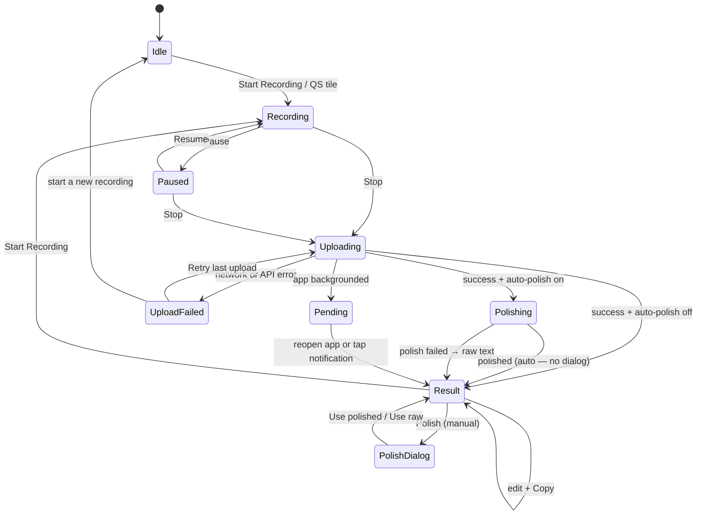

# UI flow

How a recording becomes text on the clipboard, and which component owns each transition. This is the map to read before changing anything in `MainActivity` or `RecordingService` — the flow has more branches than the feature list suggests, and several of them exist to prevent data loss.

## State diagram

## Who owns what

| Transition | Owner | Notes |
|---|---|---|
| Start / stop / pause / resume | `RecordingService` | Driven by `ACTION_*` intents from the activity, the notification, or the tile |
| Recording → Uploading | `RecordingService.stopRecording` | Computes duration from active (non-paused) time only |
| Upload + retry | `RecordingService.sendAudioToGroq` | One automatic retry on `IOException` before giving up |
| **Saving history** | `RecordingService` | Written the moment the transcription arrives — see below |
| Polish | `MainActivity.startPolish` | Uses the selected preset; auto-polish skips the dialog |
| Result screen, editing, clipboard | `MainActivity` | Updates the entry the service created; never creates a second one |

## The three branches that exist to prevent data loss

**1. History is saved by the service, not the UI.** `MainActivity` unregisters its broadcast receiver in `onStop()`. If the user locks the screen or switches apps while the upload is in flight, `STATE_SUCCESS` fires into a dead receiver. The service therefore writes the history entry itself, stores its id under `pending_result_id`, and posts a **Transcription ready** notification. `MainActivity.onStart()` claims the pending result and opens the result screen with the text copied.

A service-side clipboard write is *not* a substitute — Android 10+ blocks clipboard access for apps that are not in focus.

**2. Failed uploads keep their audio.** Recordings use unique filenames, so a failure is not overwritten by the next take. The path is remembered in `failed_audio_path` and offered as **Retry last upload**. Successful transcription clears the failure and prunes the cache.

**3. Choosing raw never discards polished.** Both versions are stored on the entry regardless of which one is displayed, so the **Show raw / Show polished** toggle and history's "Original raw" section always have something to show.

## Error branches

| Condition | Behaviour |
|---|---|
| No network at upload time | `STATE_ERROR`, audio kept, Retry offered |
| Upload > 24 MB | `STATE_ERROR` naming the size; audio kept but needs splitting |
| API error (401, 429, 5xx) | `STATE_ERROR` with the code; audio kept for a manual retry |
| Polish fails (auto) | Result screen opens with **raw** text, copied, plus a toast |
| Polish fails (manual) | Status line clears, text untouched, error toast |
| Polish length guard trips | Treated as a failure → raw kept (Clean prose only) |
| Permission denied at start | Nothing is cleared — the previous result stays on screen |

## Key state

`MainActivity` fields that survive rotation via `onSaveInstanceState`:

- `showingResult` — result screen vs recording screen
- `resultShowsPolished` — which variant the field holds (drives the label and toggle)
- `lastHistoryEntryId` — the entry to update on edit; **set from the service's broadcast**, not created locally
- `lastRawTranscription`, `lastDurationSeconds`

Shared preferences crossing the process boundary (all in `StowPrefs`):

| Key | Written by | Read by |
|---|---|---|
| `pending_result_id` | service | activity (`onStart`) |
| `ui_visible` | activity | service (whether to notify) |
| `is_recording` | service | Quick Settings tile |
| `failed_audio_path`, `failed_audio_duration` | service | activity (Retry button) |
| `selected_polish_preset`, `polish_presets` | activity | activity |
